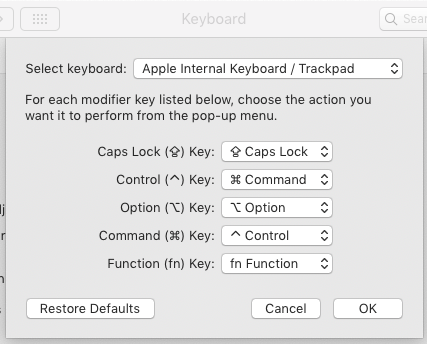

# mac-config
Some of the miscellaneous configuration files I use on my work MacBook.

This repo contains the following config files:

* [Karabiner key mapping configuration](karabiner/).

  I have a lot of muscle memory from using Windows and Linux OSs and keyboards, and this makes it a lot easier.
  
  Generally, I have my `Ctrl` key function as the MacOS `Cmd` key. However, when using the built-in MacBook keyboard, I also use Karabiner to swap the `Ctrl` and `fn` (so the bottom left key is the main modifier key).
  
  In addition to the above Karabiner settings, I have the following configured in the MacOS internal keyboard preferences for the modifier keys:
  
  
* [iTerm2 configuration](iterm2/)
  
  Especially for the colour palette that I really got used to when using Fedora.
* For my `.bashrc` configuration, see [its own specific repo](https://github.com/lucascosti/bashrc).
